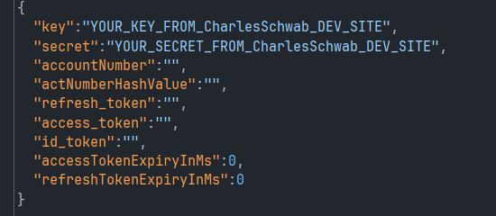

<h2>INSTRUCTIONS...</h2>

<h3>CREATE AUTH JSON</h3>
Please create a json file with the following information...
(This includes the app-key and app-secret found in your app settings
on charles schwab developers website. All other fields should be as shown below.)





<h3>LOGIN - Once per week.</h3>

```dtd
CsApi.buildApi("Path\\toyourauthjsonfile.json")

CsApi.login()
```


Follow login instructions in output to login.
Once a blank webpage is loaded, copy the url and paste into console and press ENTER.
The access token, refresh token, and account keys will be saved to your json file path.
You will need to login like this once per week.


<h3>API is ready to use...</h3>

```dtd
CsApi.buildApi("Path\\toyourauthjsonfile.json")

val csapi = CsApi.getApi()

println(csapi.getStockQuote("AAPL"))
```

